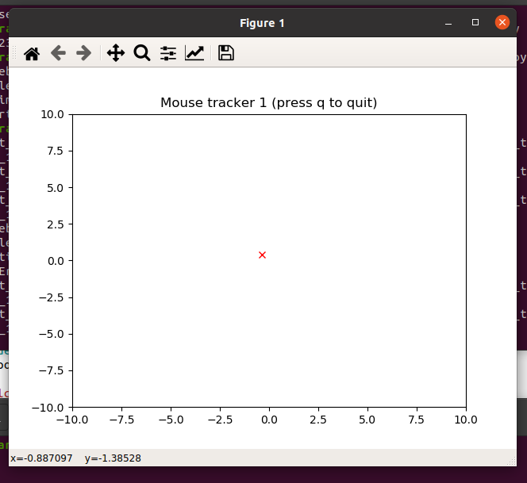

# course_examples - repository for miscellaneous codes used in my courses

## Mouse tracker
The idea of this project is to study very basics of robot control. Our "robot" is a little virtual wagon that tries to catch the mouse pointer that user moves on the screen. We move from simple but unrealistic wagon toward more complicated but more realistic system - a system that could be actually build.

### Mouse tracker 1
The first tracker is without physial limitations. The only limit is the sampling rate 't_s' for which you may try various different values, e.g., 1, 1/2, 1/4 and so on. No physical limits means that the wagon "teleports" to the new location of target which it observes 1/t_s times per second (Hz).
